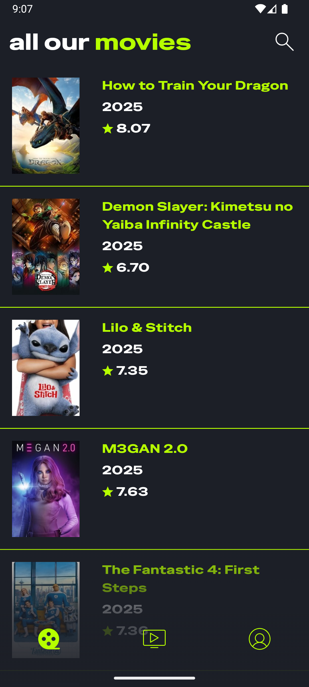
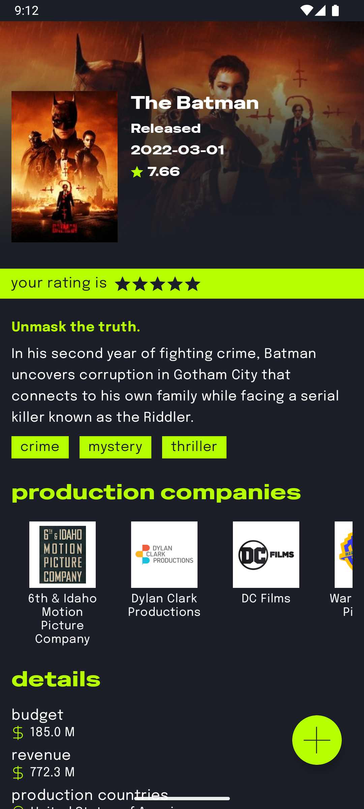
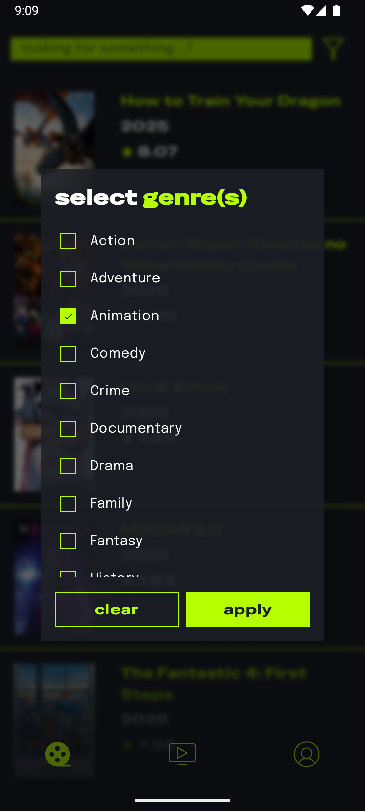
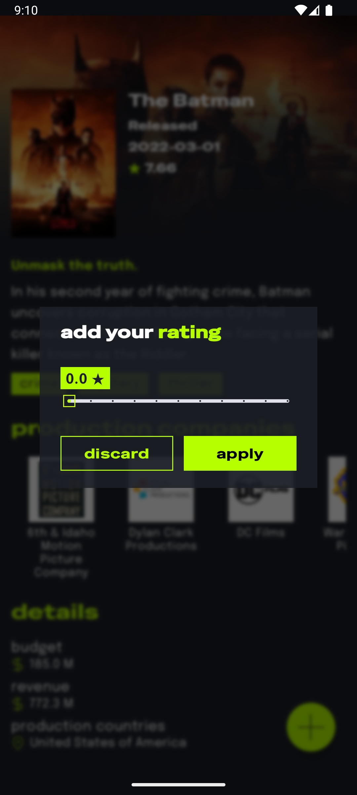
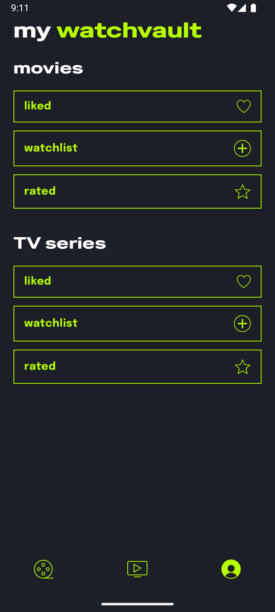
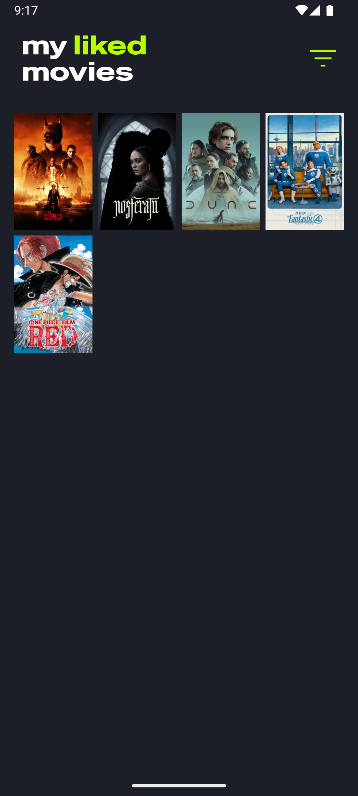

# 🎬 WatchVault

**WatchVault** is an Android application built with Kotlin and Jetpack Compose that allows users to explore and save movies and TV shows using the [TMDB (The Movie Database)](https://www.themoviedb.org/) API.

## 📱 Overview

**WatchVault** lets users search for titles, view detailed information, and organize content into custom collections like *Watchlist*, *Liked*, and *Rated*. It's ideal for movie and TV enthusiasts who want a clean, personalized tracking experience.

## ⚙️ Tech Stack

- **Kotlin**
- **Jetpack Compose**
- **MVVM architecture**
- **Hilt** for dependency injection
- **Retrofit** for network requests
- **Room** for local database
- **Navigation Component**
- **Coil** for image loading

## ✨ Features

- Search for movies and TV shows using the TMDB API  
- View detailed information including posters, synopsis, rating, genres, etc.  
- Organize titles into collections: *Liked*, *Watchlist*, *Rated*  
- Unified handling of both movies and TV shows  
- Modern UI built with Jetpack Compose and Material 3 principles  

## 🚀 Getting Started

1. **Clone the repository:**

   ```bash
   git clone https://github.com/AngelRuedaDev/WatchVault.git
   cd WatchVault
   ```
   
2. **Create a `.env` file in the root directory** and add the following:

   ```env
   TMDB_API_KEY=your_tmdb_api_key_here
   TMDB_ACCESS_TOKEN=your_tmdb_access_token_here
   ```
3. **Open the project in Android Studio.**

4. **Let Gradle sync** and build the project. This may take a few minutes the first time.

5. **Run the app** on an emulator or physical Android device via the Run button or `Shift + F10`.

## 🔐 TMDB API Setup

WatchVault uses the [TMDB API](https://developer.themoviedb.org/) to retrieve content. To access TMDB data:

- Create a free account at [TMDB](https://www.themoviedb.org/)
- Generate your API Key and Access Token (Bearer)
- Place them in a `.env` file in the root of the project:

  ```env
  TMDB_API_KEY=your_tmdb_api_key
  TMDB_ACCESS_TOKEN=your_tmdb_access_token
> ⚠️ **Do not commit** this file to version control — it's already included in `.gitignore`.

## 📸 Screenshots

<p align="center">
  
  
  
</p>

<p align="center">
  
  
  
</p>

## 🎥 Demo Video

[Watch the demo on YouTube](https://youtu.be/AKlzW33MWp4)

## 💚 Acknowledgements

Thank you to the [TMDB](https://www.themoviedb.org/) community for their amazing API.

This app was inspired by applications like **Letterboxd**.

Also huge thanks to [Helena Marti](https://www.behance.net/helenamartibarragan) for the amazing interface and logo design, make sure you follow her on [behance](https://www.behance.net/helenamartibarragan).

## 📄 License

This project is licensed under the **MIT License**. See the [LICENSE](./LICENSE) file for details.
